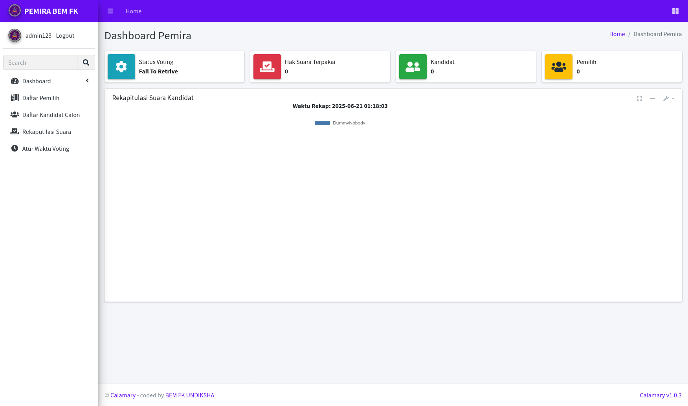

# Calamary

|  |  |
|:---------------------------------------------:|:--------------------------------------:|
| **Halaman Utama**                             | **Halaman Admin**                      |

> **Versi:** 1.0.3  
> **Proyek:** Pemilihan Umum Raya Online Ketua BEM FK Universitas Pendidikan Ganesha 2021

---

### 🛡️ Akun Admin Default
| Username | Password           |
|----------|--------------------|
| admin123 | adminpemirafk123   |

---

---

## 🎉 Selamat Datang di Calamary!

Calamary adalah platform e-voting berbasis web yang dibangun dengan Flask untuk Pemira BEM FK Universitas Pendidikan Ganesha tahun 2021. Project ini awalnya dibuat sebagai ajang belajar di bawah tekanan deadline, dan kini dirilis open source sebagai arsip dan bahan pembelajaran. Nama "Calamary" sendiri merupakan plesetan dari "calamity already"—mewakili suasana rush dan chaos saat pengembangannya!

> **Catatan Developer:**
> Ini adalah project lama yang lama tersimpan di storage saya. Semoga dengan membagikannya, bisa bermanfaat untuk pembelajaran siapa saja, meski codebase-nya jauh dari kata sempurna. Mohon maklum jika ada bagian yang "unik"—waktu itu saya masih belajar Flask dan dikejar deadline. 😅

---

## 🚀 Fitur Utama
- Voting online untuk kandidat Ketua BEM
- Autentikasi berbasis peran (admin, pemilih, panitia)
- Manajemen kandidat & suara secara dinamis
- Ekspor data (Excel)
- Dashboard AdminLTE yang interaktif
- Struktur modular dengan Flask Blueprint
- Dukungan SQLite (default) & PostgreSQL
- Siap dijalankan di container (Podman, Docker)

---

## 📦 Kebutuhan (Requirements)
Install semua dependensi dengan:

```bash
pip install -r requirements.txt
```

**Isi file `requirements.txt`:**
```txt
flask==2.2.0
flask_login
flask_migrate
flask_wtf
flask_sqlalchemy
flask_caching
email_validator
python-decouple
uwsgi
psycopg2-binary
python-dotenv
pandas
xlsxwriter
```

---

## 🐳 Instalasi dengan Podman
Cara termudah menjalankan Calamary di container:

```bash
git clone https://github.com/semarainc/calamary.git
cd calamary
podman build . -t localhost/calamary
podman run -i -t -d --restart=always \
    --network=host \
    --replace \
    --name=calamary \
    --volume $(pwd):/app \
    localhost/calamary
```

### Setup sebagai Layanan Systemd
```bash
mkdir -p ~/.config/systemd/user
podman generate systemd \
    --new \
    --name \
    --no-header \
    --restart-policy=on-failure \
    --container-prefix='' \
    --pod-prefix='' \
    --files \
    calamary
loginctl enable-linger $USER
```

---

## 🖥️ Instalasi Manual
Ingin dijalankan secara lokal? Bisa banget!

```bash
git clone https://github.com/semarainc/calamary.git
cd calamary

# Buat virtual environment
python3 -m venv env
source env/bin/activate
pip install -r requirements.txt

# Jalankan aplikasi
python3 run.py
```

---

## 🛠️ Konfigurasi
- Salin `.env.example` menjadi `.env` lalu sesuaikan (SECRET_KEY, pengaturan DB, dsb).
- Port default: **8000** (lihat di `run.py` atau ubah sesuai kebutuhan)

---

## 🐙 Kredit
- **UI & Blueprint:** [Appseed - AdminLTE Flask](https://appseed.us/admin-dashboards/flask-dashboard-adminlte)
- **Framework:** [Flask](https://flask.palletsprojects.com/)
- [AdminLTE Flask](https://appseed.us/admin-dashboards/flask-dashboard-adminlte) - Provided by **AppSeed [App Generator](https://appseed.us/app-generator)**.
- **Terima kasih khusus:** Semua pihak yang terlibat di Pemira FK dan komunitas open source!

## Lisensi
- **Lisensi:** MIT

---

## 🐞 Pelaporan Bug & Kontribusi
Menemukan bug atau ingin berkontribusi?
- Silakan buka [Issue](https://github.com/semarainc/calamary/issues) dengan detail masalah/ide Anda.
- Pull request dan saran sangat diterima! Lihat `CONTRIBUTING.md` (atau buka issue jika butuh panduan).

Ayo kembangkan Calamary bersama—lebih baik, lebih bermanfaat!

---

> _Dibuat dengan cinta, chaos, dan banyak kopi ☕ oleh @semarainc_
